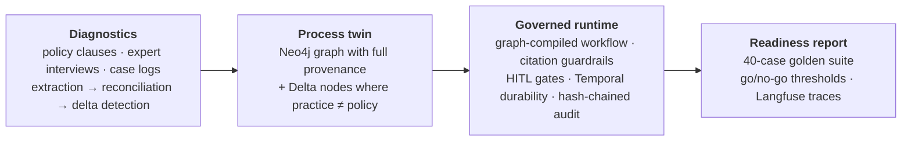

# process-twin

[](https://github.com/ashukla-be21/process-twin/actions/workflows/ci.yml)
[](LICENSE)
[](https://www.python.org/downloads/)

**From written SOP to governed agent workflow — with pre-production evaluation and full audit trails.**

Institutional knowledge lives in people's heads. Written policy drifts from what
practitioners actually do. Deploying an agent against either source alone is how regulated
automation fails — quietly, with a clean-looking audit trail.

`process-twin` ingests three knowledge sources about one banking process — **KYC/CDD
customer onboarding** — reconciles them into an inspectable process graph where
*disagreements become first-class nodes*, compiles that graph into a governed agent
workflow, and refuses to call anything production-ready until a 40-case evaluation says so.



## The two demos

### Demo 1 — the tacit-vs-written diff

The system finds where practice has quietly diverged from written policy, and shows both
sides of each divergence with evidence. Ten divergences, every one traceable to the clause
it contradicts, the practitioner who described it, and the historical cases that back it up:

| Delta | Written policy says | Practice does | Seen in | Severity |
|---|---|---|---|---|
| **D1** threshold | Identify beneficial owners at **25%** (31 CFR 1010.230) | Full scrutiny from **20%** for high-risk jurisdictions | 11/60 cases | 🔴 high |
| **D6** skipped step | Callback verification is a written control | Skipped below **$10k** expected activity | 6/60 | 🔴 high |
| **D8** unwritten rule | Screening at standard match tolerance | Tolerance **manually widened** for transliterated names | 4/60 | 🔴 high |
| **D2** undocumented acceptance | Silent on expired ID + renewal receipt | Accepted with a 30-day follow-up task | 5/60 | 🟠 medium |
| **D3** unwritten rule | No such trigger exists in policy | Two address mismatches → automatic EDD referral | 5/60 | 🟠 medium |
| **D10** practitioner conflict | Policy silent on PO-box addresses | QA **rejects**; frontline **accepts** with one extra document | 4/60 | 🟠 medium |

*(D4, D5, D7, D9 in [`data/interviews/SYNTHETIC.md`](data/interviews/SYNTHETIC.md) — the full ledger.)*

**D10 is the one to look at.** Two customers, identical facts, opposite outcomes depending
on who opened the file. Most systems would average that away during extraction. This one
keeps it as a `Delta` node with both stances attached — because a conflict the institution
hasn't resolved is not a data-quality problem to be smoothed over, it's a governance
finding to be escalated.

```bash
make diff          # markdown diff report
make api           # interactive explorer at localhost:8000/explorer
```

### Demo 2 — the pre-production readiness report

`make report` runs 40 golden cases through the compiled workflow and emits an HTML +
Markdown report with an explicit go/no-go verdict. **Latest run — VERDICT: GO:**

| Metric | Value | Threshold | |
|---|---|---|---|
| Outcome accuracy | **1.000** | ≥ 0.85 | ✅ |
| Path fidelity | **1.000** | ≥ 0.90 | ✅ |
| Escalation recall — policy conflict | **1.000** | = 1.00 | ✅ 🔒 **hard gate** |
| Escalation recall — adversarial | **1.000** | ≥ 0.83 | ✅ |
| Escalation precision | **1.000** | ≥ 0.80 | ✅ |
| Citation validity | **1.000** | ≥ 0.95 | ✅ |
| Retrieval hit@5 | **0.950** | ≥ 0.90 | ✅ |
| Confidence calibration | Brier **0.033** | reported | — |

Real numbers from `reports/<date>_<gitsha>/`, regenerated by `make report`. Getting here
took five real bugs — all of them in [`FAILURES.md`](FAILURES.md), including two written
EDD triggers that had vanished into an additive risk score.

**Why is one threshold 1.0 when outcome accuracy is only 0.85?** Because the failures have
different shapes. A wrongly-decided ordinary case is a quality defect: measurable,
improvable, catchable in review. But a case sitting exactly on an unresolved policy
question — written rule says 25%, the floor practises 20%, nobody has decided which governs
— that case must never be auto-decided. Resolving it silently produces a confidently-wrong
decision with a clean audit trail, on a real customer's file, with the system having
invented policy it had no authority to invent. That's not a quality defect; it's the system
exceeding its remit. So it gates the release outright.

## Governance features

- **Citation-validated decisions** — every decision cites clauses that must *exist* in the
  clause store and be *relevant* (cross-encoder scored). Catches both fabricated citations
  and real-but-irrelevant ones.
- **Human-in-the-loop gates** — low confidence, uncited decisions, and atom-flagged
  ambiguity all route to an approvals inbox with full context. No reviewer available means
  the case **halts**; an unattended system never approves on a human's behalf.
- **Delta guards** — any step carrying an unresolved high-severity delta gets a forced HITL
  gate the compiler places *between* the step and its successor. Model confidence cannot
  override it: confidence measures self-certainty, not which side of an open policy
  question is correct.
- **Hash-chained audit log** — append-only, each event carrying the previous event's hash.
  Tampering and deletion are both detectable, and any case replays from the log alone.
- **Durable interrupt-and-resume** — Temporal workflow per case. A case waiting on a human
  sleeps for days holding no process; kill the worker mid-case and it resumes at the same
  step with no duplicate audit events.
- **Observable** — one Langfuse trace per case, one span per atom, cost per call, guardrail
  rejections and schema retries as span events.

## Quickstart

```bash
git clone https://github.com/<you>/process-twin && cd process-twin
uv sync --all-extras
cp .env.example .env                    # add ANTHROPIC_API_KEY for phases 3+
docker compose up -d && python scripts/wait_healthy.py

make test                               # 126 tests, no infra needed
make report                             # Demo 2 — readiness report with real numbers
make fetch parse index probe            # policy corpus → clause store → retrieval hit@5
make seed                               # extraction → graph → deltas (needs API key)
make diff                               # Demo 1 — tacit-vs-written diff
make api                                # explorer + approvals inbox at :8000
make demo-durability                    # kill/restart the worker, prove the case resumes
```

## How it works

**Diagnostics.** Policy clauses are parsed with *stable IDs* derived from document
structure (`CFR-1010.230(b)(1)`, `FFIEC-CDD-¶12`) — not chunk offsets, because the citation
guardrail compares those strings and a silently re-pointed ID means a silently wrong audit.
Interviews and case logs go through the same `ProcessElement` contract. LLM extraction runs
a self-correction loop: validate → re-prompt with the error *and* the offending output →
three attempts → dead-letter with the full chain and keep going.

**Reconciliation.** Entity resolution merges the same real-world step described three
different ways. Where sources agree, confidence rises. Where they disagree, **the written
value stays canonical and the disagreement becomes a `Delta`** — never averaged away. That
single rule is the thesis of the project.

**Composition.** The graph compiles to a workflow spec: controls become guard nodes, high-
severity deltas become forced HITL gates, cycles are rejected at compile time, and a step
requiring evidence no atom can supply is a build error rather than a 3 a.m. runtime failure.
The graph is the source of truth, so a process change is a re-compile, not a code change.

**Runtime.** GraphRAG retrieval — the graph tells you *where to look* (clauses linked to
this step, plus one hop), the vectors tell you *what's similar*. Guardrails run in order of
how fundamental the problem is. Every transition appends to the hash chain.

## Honest limitations

- **Interview transcripts and case logs are synthetic and labelled as such.** Generation
  method, the full ground-truth delta ledger, and the argument for why this doesn't
  invalidate the delta-detection evaluation (plus what *would*) are in
  [`SYNTHETIC.md`](data/interviews/SYNTHETIC.md). Policy sources are real and public.
- **One process, one jurisdiction.** Depth over breadth, deliberately.
- **No real PII**, no multi-tenancy, no fine-tuning, single-node scale.
- **v1 delta detection is a transparent rule table**, not an LLM judgment call — every
  delta traces to the exact rule and evidence that fired. LLM-assisted candidate generation
  is roadmap.
- High-risk jurisdictions in the synthetic data are **fictional** (Kavastan, Zubaria, Port
  Meridian) so nothing couples to live FATF list churn or mislabels a real country.

## Roadmap

Go/gRPC worker for deterministic activities · a second process (healthcare prior-auth) to
test what generalises · Ragas-style semantic eval · policy-update diffing over time.

## Docs

[architecture decisions](docs/architecture.md) · [graph schema](docs/graph-schema.md) ·
[eval methodology](docs/eval-methodology.md) · [phase reviews](docs/phase-reviews/) ·
[FAILURES.md](FAILURES.md) · [local setup](docs/local-setup.md)

---

MIT licensed. Built by Adi Shukla. Stack: Python 3.11, Pydantic v2, LangGraph, Neo4j, Qdrant + BGE,
Temporal, Langfuse, FastAPI, pytest/ruff, Docker Compose.
