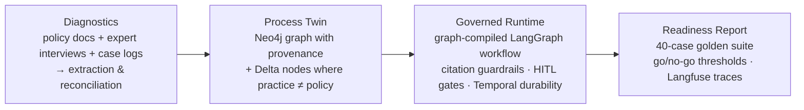

# process-twin

**From written SOP to governed agent workflow — with pre-production evaluation and full audit trails.**

Institutional knowledge lives in people's heads; written policy diverges from what practitioners
actually do; deploying agents against either source alone is how regulated automation fails.
`process-twin` ingests three knowledge sources about one banking process — KYC/CDD customer
onboarding — and produces a governed agent workflow whose every decision is cited, gated, traced,
and evaluated before anything is called "production-ready".



> **Status: work in progress, built phase by phase.** This README becomes the full document
> (with real eval numbers, never placeholders) in Phase 7. Progress and per-phase decision
> records live in [`docs/phase-reviews/`](docs/phase-reviews/).

| Phase | Scope | Status |
|---|---|---|
| 0 | Scaffold, docker environment, config, tracing bootstrap, hello atom | ✅ |
| 1 | Policy corpus → clause store with stable IDs, Qdrant index, retriever v1 | ✅ |
| 2 | Synthetic interviews + case logs with ground-truth delta ledger | ✅ |
| 3 | Extraction → reconciliation → delta detection → Neo4j process graph | ⏳ |
| 4 | Graph→LangGraph compiler, atoms, guardrails, HITL approvals API | ⏳ |
| 5 | Temporal durability + hash-chained audit log | ⏳ |
| 6 | 40-case golden suite, metrics, readiness report | ⏳ |
| 7 | Delta explorer polish, full README, demo video | ⏳ |

## What works today

```bash
cp .env.example .env          # add ANTHROPIC_API_KEY when you have one
docker compose up -d && python scripts/wait_healthy.py   # neo4j, qdrant, temporal, langfuse
make hello                    # hello atom: model call → schema validation → traced cost in Langfuse
make fetch parse index probe  # policy corpus → clause store → qdrant → hit@5 acceptance
make test                     # unit suite (also runs keyless: dry-run/no-op fallbacks)
```

## Honesty rules this repo follows

All interview transcripts and case logs are **synthetic and labeled as such** — the generation
method and the full ground-truth delta ledger are documented in
[`data/interviews/SYNTHETIC.md`](data/interviews/SYNTHETIC.md). Metrics quoted anywhere come from
real runs (`TBD` until then, never invented). Everything that broke along the way is in
[`FAILURES.md`](FAILURES.md).
